# End-to-End CI/CD for Node.js Application using Docker & GitHub Actions

## Project Overview

This project demonstrates a **CI/CD pipeline** using **GitHub Actions** for building and deploying a **Node.js demo application** as a **Docker image** to **DockerHub**.  

The workflow includes:  
1. Building a Docker image  
2. Pushing it to DockerHub  
3. Testing locally and in Docker  

---

## Step 1: Repository Setup

1. Create a folder locally:

bash ...
mkdir nodejs-demo-app
cd nodejs-demo-app

2. Initialize Git and connect to GitHub:

git init
git remote add origin https://github.com/Vsethi44/nodejs-demo-app.git
git add .
git commit -m "Initial commit"
git push -u origin main

**Screenshot:**

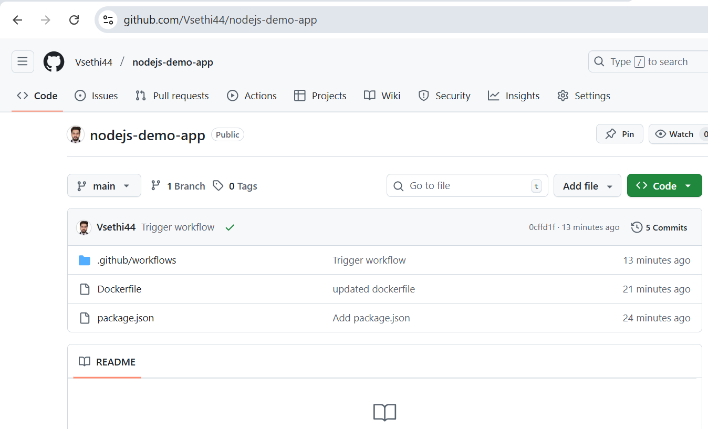

## Step 2: Create Dockerfile

1. Created `Dockerfile` in project root (capital D, no extension).  
2. Added Docker instructions to build the Node.js app image. 

FROM node:18
WORKDIR /app
COPY package*.json ./
RUN npm install
COPY . .
EXPOSE 3000
CMD ["npm", "start"]

**Screenshot:**

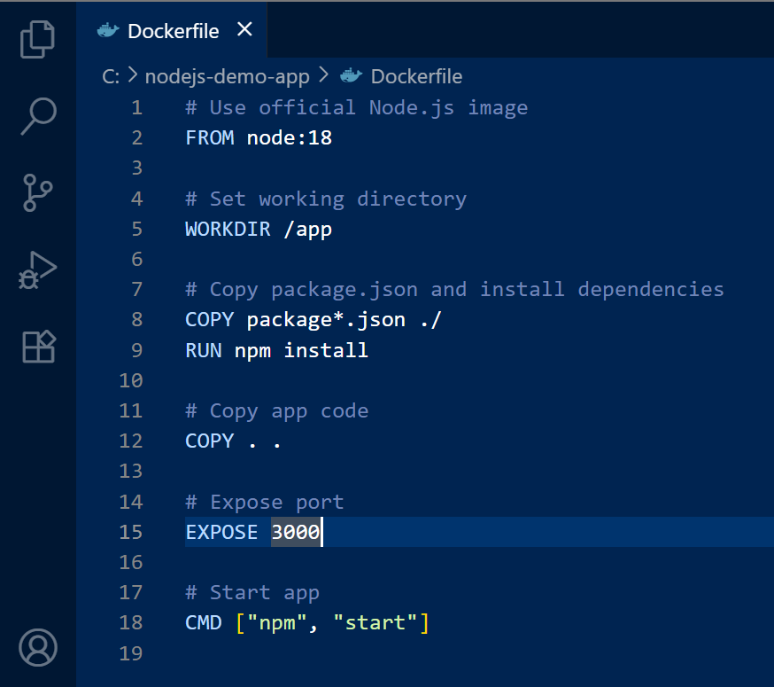

## Step 3: Add package.json

1. Initialize Node.js project:

'npm init -y'

2. Create package.json script and push it to Github repo:

**Screenshot:** 

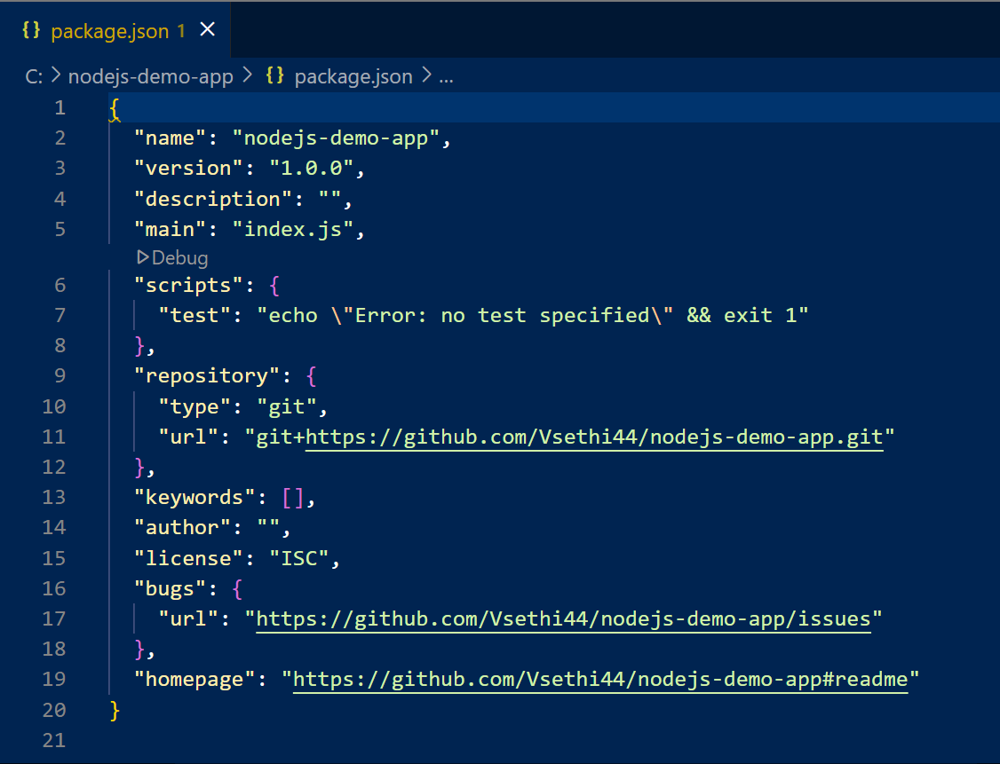 

3. Create index.js:

const express = require("express");
const app = express();

app.get("/", (req, res) => {
  res.send("Hello from Node.js App!");
});

app.listen(3000, () => {
  console.log("Server running on port 3000");
});

**Screenshots:** 

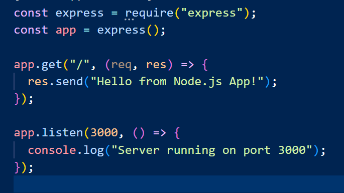

## Step 4: Prepare GitHub Actions Workflow

Create workflow file: .github/workflows/main.yml

Add CI/CD steps to:

- npm install

- Build Docker image

- Log in to DockerHub using secrets

- Push image to DockerHub

**Screenshot:**

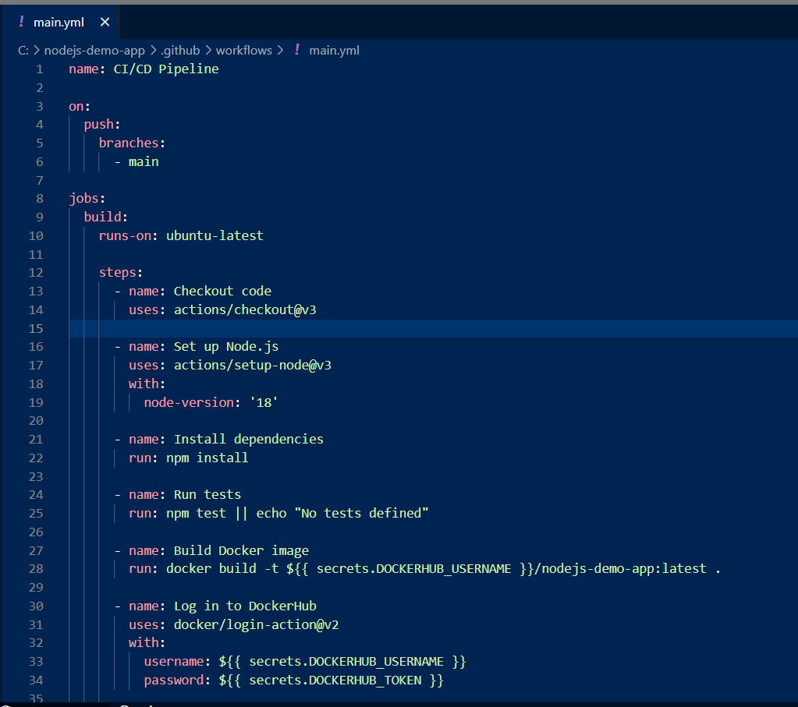

## Step 5: Configure GitHub Secrets

1. Added the following secrets in GitHub repo → Settings → Secrets → Actions:

DOCKERHUB_USERNAME → Your DockerHub username

DOCKERHUB_TOKEN → Your DockerHub access token

**Screenshot:**
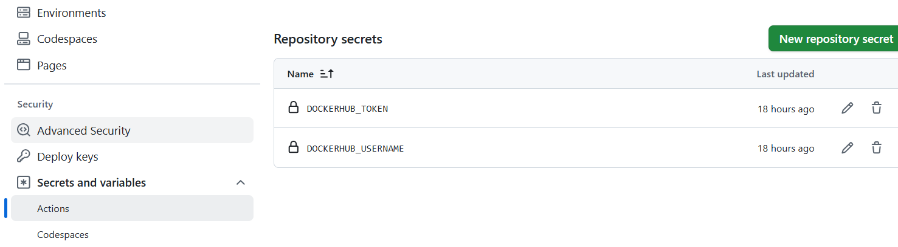

## Step 6: Run Workflow

1. Push code to trigger GitHub Actions workflow:

git add .
git commit -m "Trigger CI/CD workflow"
git push

2. Workflow builds and pushes Docker image to DockerHub

**Screenshots:**

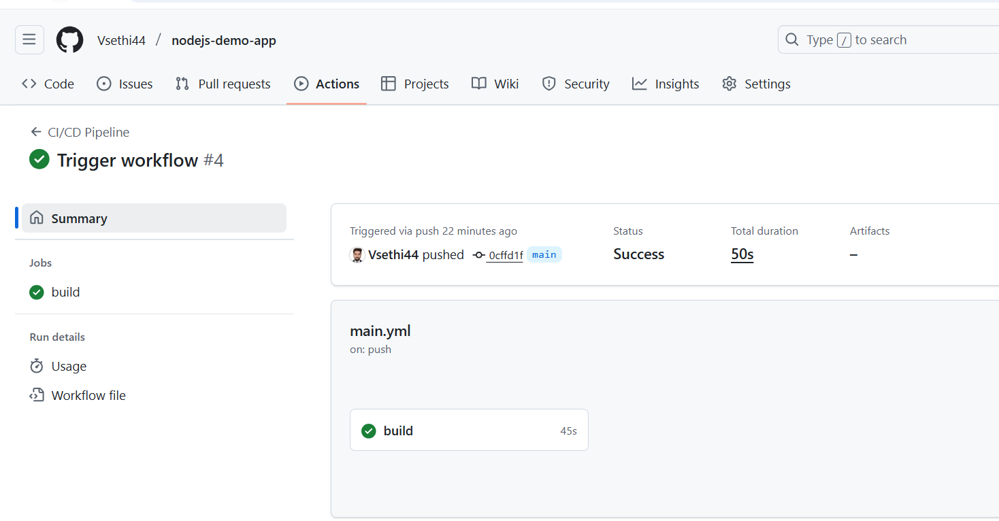

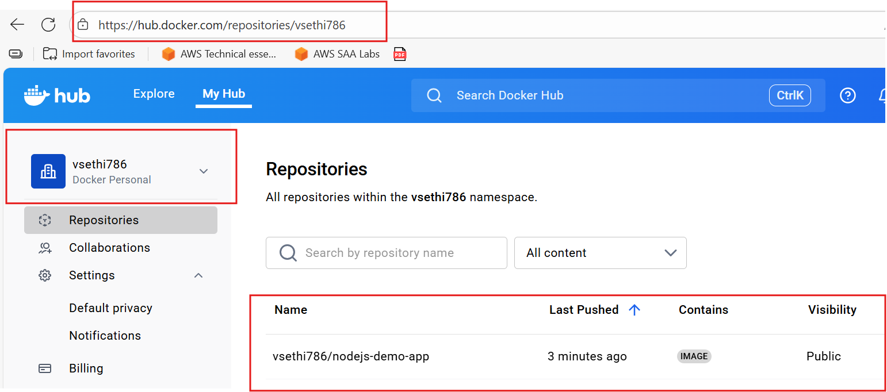

## Step 7: Local App Testing

1. Install dependencies:

'npm install express'

2. Run app locally:

'npm start'

3. Open browser: http://localhost:3000

**Screenshots:**

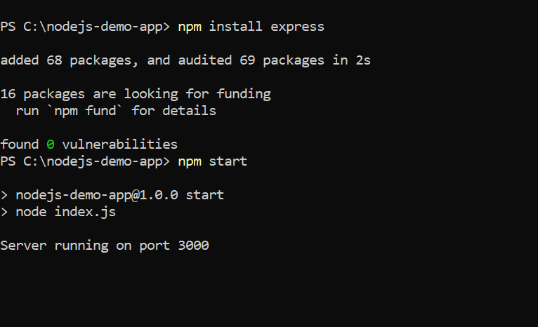
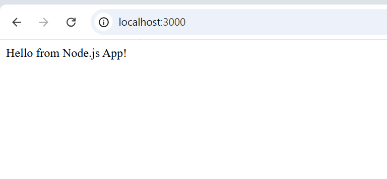

## Step 8: Docker Local Testing

1. Build Docker image:

docker build -t nodejs-demo-app .

2. Run Docker container:

docker run -p 3000:3000 nodejs-demo-app

3. Open browser: http://localhost:3000

**Screenshots:**

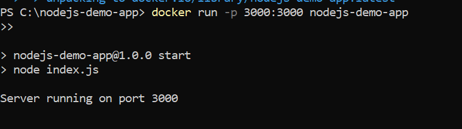
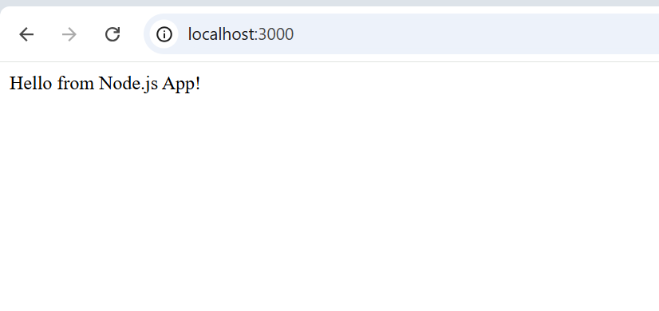

## Notes:

- Local app testing confirms Node.js app runs correctly
- Docker testing confirms CI/CD Docker image works as intended
- Screenshots folder: ./screenshots/ with all referenced images